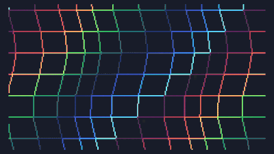

# Waves3D
A 3D wave effect with different color palettes and some sound in just 255 bytes. Made for the TIC-80. The final Lua cartridge was compressed using  using [pakettic by vsariola](https://github.com/vsariola/pakettic)

Made for Deadline 2024. [(entry link)](https://demozoo.org/productions/358714/)

